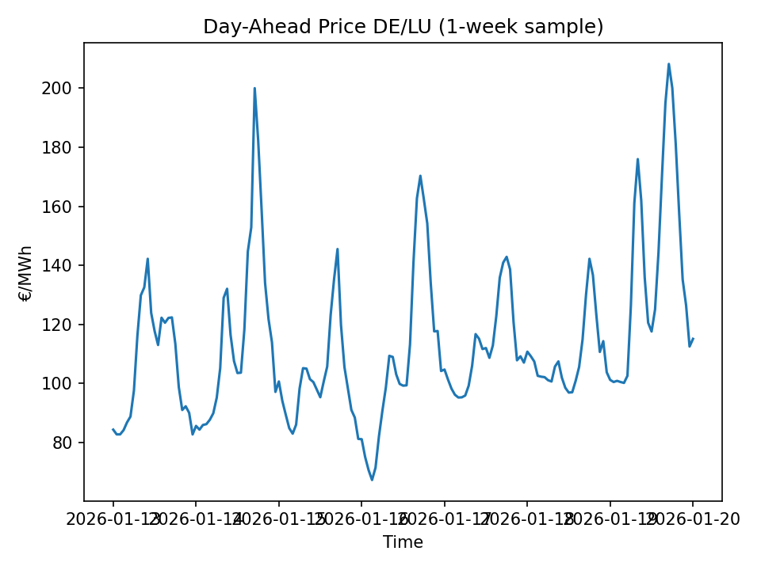

# Renewables Capture Prices & Cannibalization (DE/LU)

A small, auditable Python pipeline that builds a clean hourly dataset from SMARD (Bundesnetzagentur) and computes basic **capture prices / capture ratios** for wind and solar in the German/Luxembourg day-ahead market.

## What’s in here (v0)
- Hourly **day-ahead price** (DE/LU)
- Hourly **generation** (wind onshore/offshore, solar PV)
- Hourly **load**
- v0 outputs: first plot + capture metrics (wind/solar)

## Outputs (v0)

### Day-ahead price (1-week sample)


### Capture metrics (2026-01-13 to 2026-02-24)

| Metric | Value |
| --- | ---: |
| Base price (€/MWh) | 110.16 |
| Wind capture price (€/MWh) | 103.53 |
| Wind capture ratio | 0.94 |
| Solar capture price (€/MWh) | 106.84 |
| Solar capture ratio | 0.97 |

Raw CSV: `outputs/metrics/capture_metrics_20260113_20260224.csv`

## How to run

1. Put SMARD CSV exports into `data_raw/` (ignored by git).

2. Install dependencies:

```bash
python3 -m pip install -r requirements.txt
```

3. Run the pipeline:

```bash
python3 src/01_ingest_clean.py
python3 src/02_first_plot.py
python3 src/03_capture_metrics.py
```

## Data notes
- SMARD CSVs use `;` as separator and German number formatting (decimal `,`, thousands `.`).
- Missing price hours are dropped for capture calculations in v0.

## Next steps
- Monthly/weekly capture ratios (time-varying cannibalization)
- Visualize price vs. wind/solar (scatter / quantile bins)
- Add a lightweight notebook/report for storytelling
